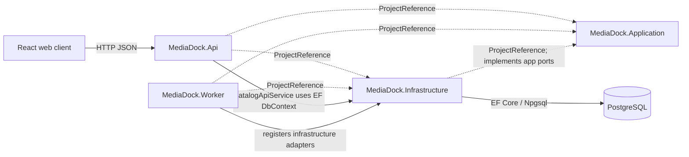
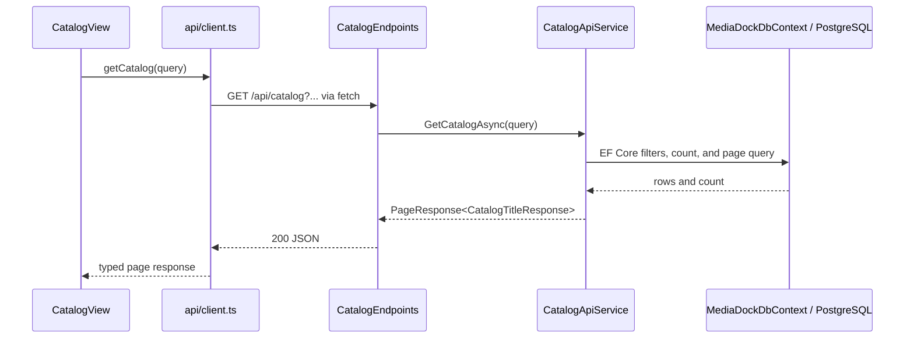
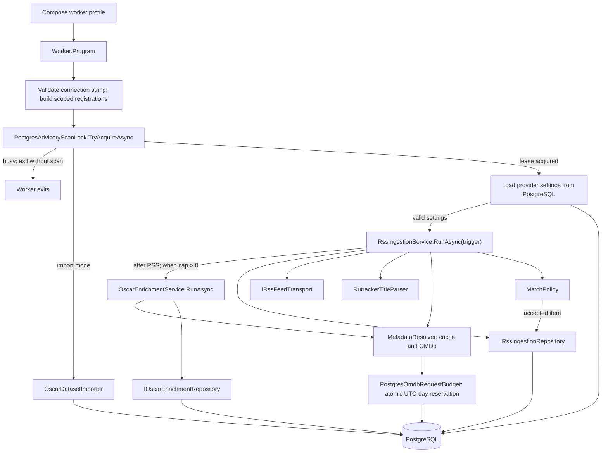
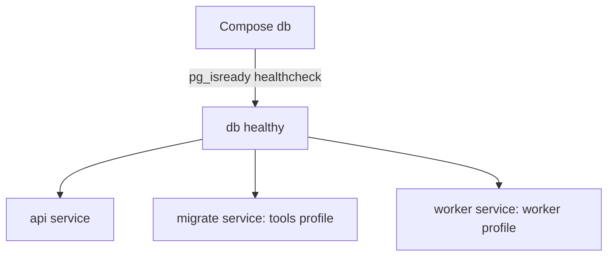

# Architecture and Runtime Flows

This guide covers the standalone React client, .NET API and Worker, and PostgreSQL database in this repository. See [project context](PROJECT_CONTEXT.md) for the main directories and [local runbook](../../README.md) for operational commands.

## Responsibilities and Dependencies

Solid arrows show runtime traffic or calls; dashed arrows show .NET project references.

- [Application](../../server/src/MediaDock.Application/MediaDock.Application.csproj) has no project references. It contains the reusable ingestion use case and its contracts, parsing, matching, and metadata-resolution logic.
- [Infrastructure](../../server/src/MediaDock.Infrastructure/MediaDock.Infrastructure.csproj) references Application. It supplies PostgreSQL/EF Core persistence and adapters implementing application contracts, including the [PostgreSQL ingestion repository](../../server/src/MediaDock.Infrastructure/Ingestion/PostgresRssIngestionRepository.cs).
- [API](../../server/src/MediaDock.Api/MediaDock.Api.csproj) and [Worker](../../server/src/MediaDock.Worker/MediaDock.Worker.csproj) each reference Application and Infrastructure. Their `Program.cs` files are separate composition roots: the API maps HTTP routes and registers API services; the Worker configures and runs the ingestion process.
- The [web client](../../web/src/api/client.ts) is a separate React/TypeScript project that talks to the API over HTTP; it does not reference .NET projects. The [server Dockerfile](../../server/Dockerfile) builds the web app and copies its static output into the API image. In production the API serves those files, so Compose has no separate web service.

The project references describe what each project can reference, not the path every request takes. In particular, the current catalog read path is implemented in the API and directly uses Infrastructure's `MediaDockDbContext`; it does not pass through an Application catalog use case.

## Catalog HTTP Flow

The [catalog view](../../web/src/features/catalog/CatalogView.tsx) builds the query and calls `getCatalog`. The [API client](../../web/src/api/client.ts) serializes query values, prefixes `/api`, and calls `fetch`; its TypeScript contracts live in [api/types.ts](../../web/src/api/types.ts). On the server, [API startup](../../server/src/MediaDock.Api/Program.cs) registers `ICatalogApiService` and maps routes from [CatalogEndpoints](../../server/src/MediaDock.Api/Catalog/CatalogEndpoints.cs). The endpoint delegates to [CatalogApiService](../../server/src/MediaDock.Api/Catalog/CatalogApiService.cs), which filters, counts, orders, pages, and projects EF queries over the Infrastructure [DbContext](../../server/src/MediaDock.Infrastructure/Persistence/MediaDockDbContext.cs). The HTTP query and response DTOs are in [CatalogContracts](../../server/src/MediaDock.Api/Catalog/CatalogContracts.cs).

For catalog behavior, start with the API endpoint, contract, or service that owns the change. Keep the current query there unless the code gains a real shared use case; do not add an Application abstraction just to make the layers look uniform.

## Worker Ingestion Flow

The [Worker entry point](../../server/src/MediaDock.Worker/Program.cs) accepts `manual` or `schedule` RSS triggers (defaulting to `manual`) and the separate `--import-oscar <csv-path> [--year-after N]` command. A scan acquires the advisory lock, then loads the OMDb key and request limits from the singleton `settings` row with `id = 1`. The web API accepts a replacement key but returns only whether one is configured. The shared daily limit must be positive; positive Oscar per-run and daily caps enable the [OscarEnrichmentService](../../server/src/MediaDock.Application/OscarAwards/OscarEnrichmentService.cs), which shares the resolver/cache, request budget, and advisory lock. The first cap counts candidates per invocation; the second caps Oscar HTTP attempts per UTC day. Oscar imports require only the database connection, acquire the same advisory lock, and call Infrastructure's [OscarDatasetImporter](../../server/src/MediaDock.Infrastructure/OscarAwards/OscarDatasetImporter.cs); they do not call OMDb. The reader accepts compact comma-separated files and the tab-separated Kaggle source. The application [ingestion contracts](../../server/src/MediaDock.Application/Ingestion/RssIngestionContracts.cs) define the RSS repository and feed-transport ports.

The use case starts a run and loads enabled sources and match settings through the repository. It fetches each feed, parses titles with [RutrackerTitleParser](../../server/src/MediaDock.Application/Parsing/RutrackerTitleParser.cs), resolves metadata through [MetadataResolver](../../server/src/MediaDock.Application/Metadata/MetadataResolver.cs), applies [MatchPolicy](../../server/src/MediaDock.Application/Matching/MatchPolicy.cs), and asks the repository to upsert accepted catalog items. It also flushes parse logs and completes the run. Infrastructure provides the [PostgreSQL repository](../../server/src/MediaDock.Infrastructure/Ingestion/PostgresRssIngestionRepository.cs), [feed transport adapter](../../server/src/MediaDock.Infrastructure/Ingestion/RssFeedTransportAdapter.cs), [PostgresMetadataCacheStore](../../server/src/MediaDock.Infrastructure/Metadata/PostgresMetadataCacheStore.cs), [PostgresOmdbRequestBudget](../../server/src/MediaDock.Infrastructure/Metadata/PostgresOmdbRequestBudget.cs), and [OmdbClient](../../server/src/MediaDock.Infrastructure/Metadata/OmdbClient.cs), registered by the Worker. The client reserves once immediately before each non-cache HTTP attempt, so yearless fallbacks and retries share the same UTC-day counter. The global cap is configured in the web UI; no OMDb plan quota is assumed.

### Advisory-Lock Boundary

[PostgresAdvisoryScanLock](../../server/src/MediaDock.Worker/Locking/PostgresAdvisoryScanLock.cs) uses PostgreSQL's session-level `pg_try_advisory_lock` and releases it with `pg_advisory_unlock` when its async lease is disposed. The Worker holds that lease around RSS followed by optional Oscar enrichment, or around an Oscar import; if acquisition fails, it exits with code `75` without starting the requested task. The lock uses the Worker-scoped `MediaDockDbContext` connection and is acquired only by the Worker path. API requests and the migration branch do not acquire it, so it coordinates cooperating Worker invocations, not catalog reads or schema migrations. Keep this runner-level coordination in the Worker rather than moving it into the shared use case.

## Startup and Health

The [Compose file](../../compose.yaml) defines PostgreSQL (`db`), the API (`api`), a one-shot `migrate` service, and an opt-in one-shot `worker` service. API, migration, and Worker services wait for the database healthcheck. The migration service uses the API image with `--migrate true`; the [API entry point](../../server/src/MediaDock.Api/Program.cs) then runs EF Core migrations and exits before mapping HTTP routes. Normal API startup does not migrate, and Compose does not make `api` depend on `migrate`; the [runbook](../../README.md) documents the intended local order.

API startup registers `MediaDockDbContext` with Npgsql from `ConnectionStrings:MediaDock`. `/health/live` reports process liveness; `/health/ready` calls `Database.CanConnectAsync` and returns 503 when PostgreSQL is unavailable, as implemented by [HealthEndpoints](../../server/src/MediaDock.Api/Health/HealthEndpoints.cs) and [ReadinessService](../../server/src/MediaDock.Api/Health/ReadinessService.cs). Compose configures a healthcheck for `db`, not an API healthcheck; the readiness endpoint is not currently wired as a Compose healthcheck.

The API image serves the bundled React app only in Production, via the default/static-file middleware and SPA fallback in `Program.cs`; its assets are produced by the [server Dockerfile](../../server/Dockerfile). Compose binds the API host port to loopback. This is an unauthenticated local MVP; keep the deployment boundary described in [project context](PROJECT_CONTEXT.md).

## Where to Change Things

| Change | Start here |
| --- | --- |
| HTTP route, validation, response contract, or catalog query | [CatalogEndpoints](../../server/src/MediaDock.Api/Catalog/CatalogEndpoints.cs), [CatalogContracts](../../server/src/MediaDock.Api/Catalog/CatalogContracts.cs), [CatalogApiService](../../server/src/MediaDock.Api/Catalog/CatalogApiService.cs), and [API Program](../../server/src/MediaDock.Api/Program.cs) |
| React screen, HTTP serialization, or browser types | [CatalogView](../../web/src/features/catalog/CatalogView.tsx), [API client](../../web/src/api/client.ts), and [api/types.ts](../../web/src/api/types.ts) |
| Feed parsing, ingestion sequencing, matching, or metadata-resolution behavior | [RssIngestionService](../../server/src/MediaDock.Application/Ingestion/RssIngestionService.cs), [ingestion contracts](../../server/src/MediaDock.Application/Ingestion/RssIngestionContracts.cs), [RutrackerTitleParser](../../server/src/MediaDock.Application/Parsing/RutrackerTitleParser.cs), [MatchPolicy](../../server/src/MediaDock.Application/Matching/MatchPolicy.cs), and [MetadataResolver](../../server/src/MediaDock.Application/Metadata/MetadataResolver.cs) |
| Oscar CSV import, nominated-film persistence, or category filtering | [OscarDatasetImporter](../../server/src/MediaDock.Infrastructure/OscarAwards/OscarDatasetImporter.cs), [OscarCsvDatasetReader](../../server/src/MediaDock.Infrastructure/OscarAwards/OscarCsvDatasetReader.cs), Oscar persistence entities/configurations, and [Worker Program](../../server/src/MediaDock.Worker/Program.cs) |
| PostgreSQL schema, EF mapping, ingestion persistence, or provider adapters | Infrastructure persistence beginning at [MediaDockDbContext](../../server/src/MediaDock.Infrastructure/Persistence/MediaDockDbContext.cs), [PostgresRssIngestionRepository](../../server/src/MediaDock.Infrastructure/Ingestion/PostgresRssIngestionRepository.cs), [PostgresMetadataCacheStore](../../server/src/MediaDock.Infrastructure/Metadata/PostgresMetadataCacheStore.cs), [OmdbClient](../../server/src/MediaDock.Infrastructure/Metadata/OmdbClient.cs), and [RssFeedTransportAdapter](../../server/src/MediaDock.Infrastructure/Ingestion/RssFeedTransportAdapter.cs); use the [local runbook](../../README.md) for migration order |
| Worker arguments, dependency wiring, exit behavior, or scan coordination | [Worker Program](../../server/src/MediaDock.Worker/Program.cs), [PostgresAdvisoryScanLock](../../server/src/MediaDock.Worker/Locking/PostgresAdvisoryScanLock.cs), and [Compose](../../compose.yaml) |
| Image targets, service startup, or local operational procedure | [server Dockerfile](../../server/Dockerfile), [Compose](../../compose.yaml), and the [local runbook](../../README.md) |