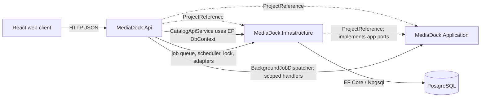
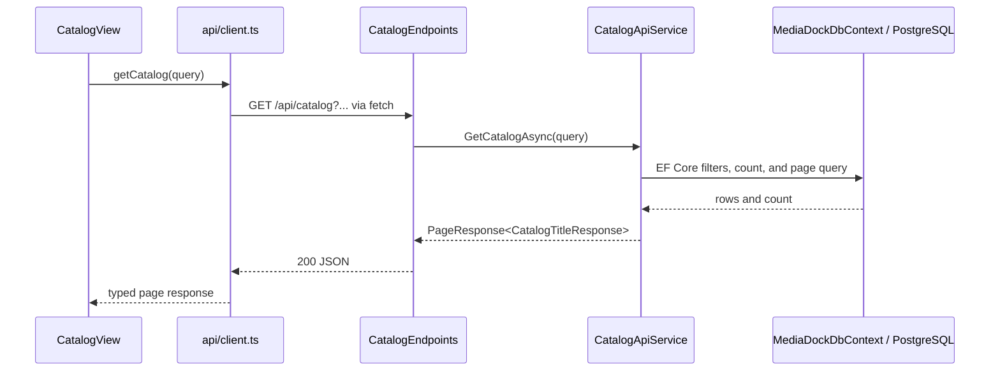
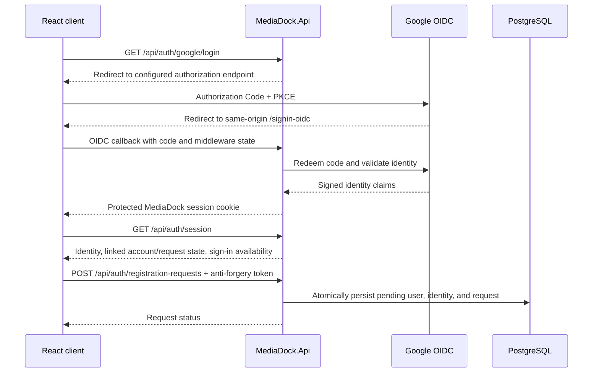
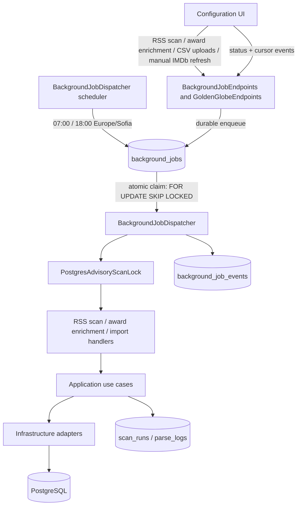
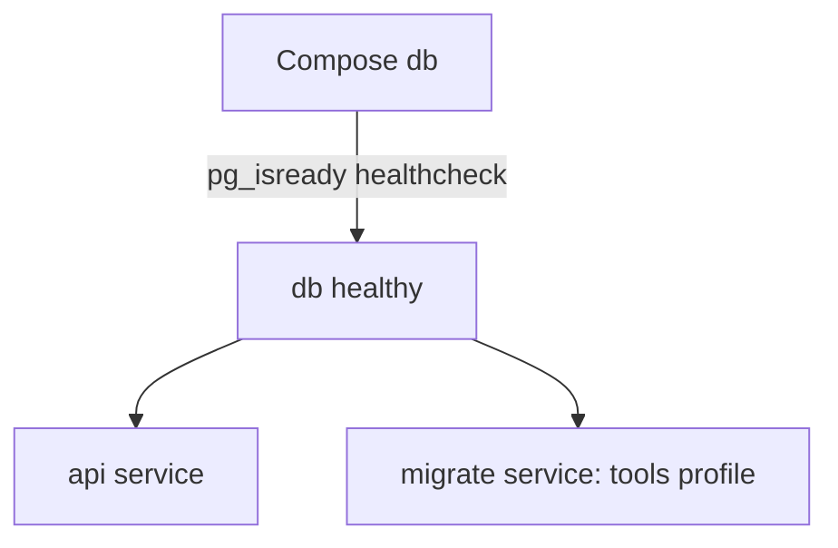

# Architecture and Runtime Flows

This guide covers the standalone React client, API-hosted background jobs, and PostgreSQL database. See [project context](PROJECT_CONTEXT.md) for the main directories and [local runbook](../../README.md) for operational commands.

## Responsibilities and Dependencies

Solid arrows show runtime traffic or calls; dashed arrows show .NET project references.

- [Application](../../server/src/MediaDock.Application/MediaDock.Application.csproj) has no project references. It contains ingestion use cases and contracts, parsing, matching, and metadata-resolution logic.
- [Infrastructure](../../server/src/MediaDock.Infrastructure/MediaDock.Infrastructure.csproj) references Application. It supplies PostgreSQL/EF Core persistence and adapters implementing application contracts, including the [PostgreSQL ingestion repository](../../server/src/MediaDock.Infrastructure/Ingestion/PostgresRssIngestionRepository.cs).
- [API](../../server/src/MediaDock.Api/MediaDock.Api.csproj) references Application and Infrastructure and is the only ingestion runtime/composition root. Its HTTP endpoints enqueue requests; one hosted dispatcher claims and executes them.
- The [web client](../../web/src/api/client.ts) is a separate React/TypeScript project that talks to the API over HTTP; it does not reference .NET projects. The [server Dockerfile](../../server/Dockerfile) builds the web app and copies its static output into the API image. In production the API serves those files, so Compose has no separate web service.

The project references describe what each project can reference, not the path every request takes. In particular, the current catalog read path is implemented in the API and directly uses Infrastructure's `MediaDockDbContext`; it does not pass through an Application catalog use case.

## Catalog HTTP Flow

The [catalog view](../../web/src/features/catalog/CatalogView.tsx) builds the query and calls `getCatalog`. The [API client](../../web/src/api/client.ts) serializes query values, prefixes `/api`, and calls `fetch`; its TypeScript contracts live in [api/types.ts](../../web/src/api/types.ts). On the server, [API startup](../../server/src/MediaDock.Api/Program.cs) registers `ICatalogApiService` and maps routes from [CatalogEndpoints](../../server/src/MediaDock.Api/Catalog/CatalogEndpoints.cs). The endpoint delegates to [CatalogApiService](../../server/src/MediaDock.Api/Catalog/CatalogApiService.cs), which filters, counts, orders, pages, and projects EF queries over the Infrastructure [DbContext](../../server/src/MediaDock.Infrastructure/Persistence/MediaDockDbContext.cs). The HTTP query and response DTOs are in [CatalogContracts](../../server/src/MediaDock.Api/Catalog/CatalogContracts.cs).

Favorites follow the same direct API-to-EF pattern: [FavoriteApiService](../../server/src/MediaDock.Api/Favorites/FavoriteApiService.cs) owns filtering, page projection, source-checked atomic additions and independent marker updates. [FavoriteProvider](../../web/src/features/favorites/FavoriteContext.tsx) shares current favorites between catalogs, dialogs and the favorites screen; title detail requests separately load Oscar records and torrent occurrences by canonical `TitleId`.

## Optional Google Identity Flow

Google OIDC uses the ASP.NET Core middleware with authorization code flow, PKCE, state/nonce/correlation checks, and server-side token validation. The callback is `/signin-oidc` on the configured same origin. The default local URI is `http://localhost:8080/signin-oidc`; local setup uses `localhost` consistently. Other configured callbacks must use HTTPS and a hostname. The session is held in a protected, host-only, `HttpOnly`, `Secure`, `SameSite=Lax` cookie with a 12-hour absolute lifetime and no sliding renewal. Provider tokens are neither saved nor returned to the browser. Link, registration-request, and logout mutations require anti-forgery validation.

Sign-in is optional and disabled by default. The validated Google identity may be explicitly linked to a pre-provisioned account or submit one idempotent registration request; registration requires the separate given-name and family-name claims. The one-shot `bootstrap-admin` Compose tool is operator-only and trusts its supplied values, so the operator must copy the verified identity fields from `GET /api/auth/session`; the tool does not independently validate them. Registration requests can be reviewed in Configuration > Users through dedicated endpoints that check the linked identity's current active-admin status on every request and require anti-forgery validation for mutations. This is not system-wide authorization: all other application APIs remain anonymously usable, and favorites/ratings remain shared-profile data. The UI warning and loopback/specific-interface-plus-firewall network boundary are still required. See [API contracts](API_CONTRACTS.md), [security and operations](SECURITY_AND_OPERATIONS.md), and the [local runbook](../../README.md) for endpoint and operator details.

For catalog behavior, start with the API endpoint, contract, or service that owns the change. Keep the current query there unless the code gains a real shared use case; do not add an Application abstraction just to make the layers look uniform.

## API-Hosted Ingestion Flow

The API exposes producers and read-only status/event routes in
[BackgroundJobEndpoints](../../server/src/MediaDock.Api/BackgroundJobs/BackgroundJobEndpoints.cs).
HTTP requests validate and persist work; they never run a scan inline. The one
hosted [BackgroundJobDispatcher](../../server/src/MediaDock.Api/BackgroundJobs/BackgroundJobDispatcher.cs)
uses a scoped `MediaDockDbContext`, acquires the session advisory lock, claims
one job in a short transaction, then executes the handler while retaining the
lease. Queued jobs survive API restarts. Stale `running` jobs are marked
`interrupted` after the next dispatcher acquires the lock; they are not retried.

The [scheduler](../../server/src/MediaDock.Api/BackgroundJobs/BackgroundJobScheduler.cs)
persists a checkpoint and UTC schedule slots. Its first activation initializes
the checkpoint without replaying historical slots; later downtime coalesces
missed due slots into one job. The 07:00/18:00 `Europe/Sofia` conversion is
deterministic across DST. Partial unique indexes prevent more than one
queued/running RSS scan and more than one active Oscar or Golden Globes
enrichment job, while a unique slot index makes schedule enqueue idempotent.

RSS, Oscar, and Golden Globes handlers load the OMDb key and shared daily limit from the singleton
`settings` row inside the job scope. The atomic budget allows requests up to that
configured shared limit; Oscar and Golden Globes requests consume the same total
budget, while only Oscar requests increment the separate `OscarRequests` counter. An OMDb quota error
also blocks further requests for that UTC day. Credentials never enter job payloads
or API responses.
`RssIngestionService` reports stage/source/counter snapshots at feed boundaries
and periodically during processing. New parse logs store their `scan_run_id`;
older rows remain unassociated. Oscar and Golden Globes enrichment are separate
manual jobs using the same lock and resolver/cache/shared budget; Golden Globes
enrichment does not write to RSS history or an enrichment-run audit table. Setting
a manual Golden Globes IMDb ID commits the exact group pin and targeted refresh
job atomically; clearing a link invalidates its current version. The dispatcher
resolves the fixed IMDb ID, persists an ID-keyed cache entry, and applies results
only if the stored link version still matches; batch enrichment skips manual pins. CSV/TSV
uploads are bounded bytes stored with queued imports; importers parse them without
a host path and clear the bytes at terminal state.

### Advisory-Lock Boundary

[PostgresAdvisoryScanLock](../../server/src/MediaDock.Infrastructure/Ingestion/PostgresAdvisoryScanLock.cs)
uses PostgreSQL session-level `pg_try_advisory_lock` and releases it with
`pg_advisory_unlock` when the async lease is disposed. The dispatcher holds the
lease across queue claim and one RSS scan, Oscar or Golden Globes enrichment, or either dataset import.
If another cooperating runner holds the same lock, the job remains queued for
a later poll. The lock does not serialize ordinary API writes or migrations.

## Startup and Health

The [Compose file](../../compose.yaml) defines PostgreSQL (`db`), the API (`api`), and a one-shot `migrate` service. Both API and migration wait for the database healthcheck. The migration service uses the API image with `--migrate true`; [API startup](../../server/src/MediaDock.Api/Program.cs) applies EF Core migrations and exits before `app.Run`, so the hosted dispatcher does not start in migration mode. Normal API startup does not migrate, and Compose does not make `api` depend on `migrate`; the [runbook](../../README.md) documents the intended order.

API startup registers `MediaDockDbContext` with Npgsql from `ConnectionStrings:MediaDock`. `/health/live` reports process liveness; `/health/ready` calls `Database.CanConnectAsync` and returns 503 when PostgreSQL is unavailable, as implemented by [HealthEndpoints](../../server/src/MediaDock.Api/Health/HealthEndpoints.cs) and [ReadinessService](../../server/src/MediaDock.Api/Health/ReadinessService.cs). Compose configures a healthcheck for `db`, not an API healthcheck; the readiness endpoint is not currently wired as a Compose healthcheck.

The API image serves the bundled React app only in Production, via the default/static-file middleware and SPA fallback in `Program.cs`; its assets are produced by the [server Dockerfile](../../server/Dockerfile). Compose binds the API host port to loopback. Google identity is optional and does not authorize API access; preserve the open-mode warning and deployment boundary described in [project context](PROJECT_CONTEXT.md).

The Configuration deployment panel proxies status and start requests through
the API to a root-owned host control service over a read-only-mounted Unix
socket. That service accepts only status, immediate start of the fixed deploy
unit, or a retry of a failed staging gate. It does not expose a shell or Docker
socket; see the [systemd runbook](../../deploy/systemd/README.md) for host setup.

## Where to Change Things

| Change | Start here |
| --- | --- |
| HTTP route, validation, response contract, or catalog query | [CatalogEndpoints](../../server/src/MediaDock.Api/Catalog/CatalogEndpoints.cs), [CatalogContracts](../../server/src/MediaDock.Api/Catalog/CatalogContracts.cs), [CatalogApiService](../../server/src/MediaDock.Api/Catalog/CatalogApiService.cs), and [API Program](../../server/src/MediaDock.Api/Program.cs) |
| Golden Globes API catalog, import, or enrichment | [GoldenGlobeEndpoints](../../server/src/MediaDock.Api/GoldenGlobes/GoldenGlobeEndpoints.cs), [GoldenGlobeApiService](../../server/src/MediaDock.Api/GoldenGlobes/GoldenGlobeApiService.cs), [GoldenGlobeDatasetImporter](../../server/src/MediaDock.Infrastructure/GoldenGlobes/GoldenGlobeDatasetImporter.cs), and [GoldenGlobeEnrichmentService](../../server/src/MediaDock.Application/GoldenGlobes/GoldenGlobeEnrichmentService.cs) |
| React screen, HTTP serialization, or browser types | [CatalogView](../../web/src/features/catalog/CatalogView.tsx), [API client](../../web/src/api/client.ts), and [api/types.ts](../../web/src/api/types.ts) |
| Feed parsing, ingestion sequencing, matching, or metadata-resolution behavior | [RssIngestionService](../../server/src/MediaDock.Application/Ingestion/RssIngestionService.cs), [ingestion contracts](../../server/src/MediaDock.Application/Ingestion/RssIngestionContracts.cs), [RutrackerTitleParser](../../server/src/MediaDock.Application/Parsing/RutrackerTitleParser.cs), [MatchPolicy](../../server/src/MediaDock.Application/Matching/MatchPolicy.cs), and [MetadataResolver](../../server/src/MediaDock.Application/Metadata/MetadataResolver.cs) |
| Oscar CSV import, nominated-film persistence, or category filtering | [BackgroundJobApiService](../../server/src/MediaDock.Api/BackgroundJobs/BackgroundJobApiService.cs), [OscarDatasetImporter](../../server/src/MediaDock.Infrastructure/OscarAwards/OscarDatasetImporter.cs), [OscarCsvDatasetReader](../../server/src/MediaDock.Infrastructure/OscarAwards/OscarCsvDatasetReader.cs), and Oscar persistence entities/configurations |
| PostgreSQL schema, EF mapping, ingestion persistence, or provider adapters | Infrastructure persistence beginning at [MediaDockDbContext](../../server/src/MediaDock.Infrastructure/Persistence/MediaDockDbContext.cs), [PostgresRssIngestionRepository](../../server/src/MediaDock.Infrastructure/Ingestion/PostgresRssIngestionRepository.cs), [PostgresMetadataCacheStore](../../server/src/MediaDock.Infrastructure/Metadata/PostgresMetadataCacheStore.cs), [OmdbClient](../../server/src/MediaDock.Infrastructure/Metadata/OmdbClient.cs), and [RssFeedTransportAdapter](../../server/src/MediaDock.Infrastructure/Ingestion/RssFeedTransportAdapter.cs); use the [local runbook](../../README.md) for migration order |
| Job persistence, atomic claim, schedule, progress, or recovery | [BackgroundJobDispatcher](../../server/src/MediaDock.Api/BackgroundJobs/BackgroundJobDispatcher.cs), [BackgroundJobScheduler](../../server/src/MediaDock.Api/BackgroundJobs/BackgroundJobScheduler.cs), and [BackgroundJobConfigurations](../../server/src/MediaDock.Infrastructure/Persistence/Configurations/BackgroundJobConfigurations.cs) |
| Image targets, service startup, or local operational procedure | [server Dockerfile](../../server/Dockerfile), [Compose](../../compose.yaml), and the [local runbook](../../README.md) |