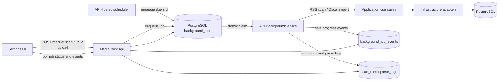

# План: Server-hosted background ingestion

**Статус:** реализиран в source кода; full quality gates и production rollout са отделни оставащи проверки
**Дата:** 2026-10-01

## Цел

RSS ingestion-ът и свързаното с него Oscar enrichment да се изпълняват само като вътрешна server логика в `MediaDock.Api`. Операторът да може да поиска ръчно сканиране от UI/API, а API процесът да създава автоматични заявки по график. И двата входа подават задача към една и съща постоянна опашка и един и същ изпълнител.

Не трябва да останат самостоятелен `MediaDock.Worker` executable, отделен Compose service/image, CLI команда или systemd timer, чрез които сканирането може да се стартира извън API проекта. Спрян API означава, че няма изпълнение на ingestion и няма scheduler.

## Решения и ограничения

1. **Един runtime и един път за изпълнение.** `BackgroundService` в API-то взема задачи от PostgreSQL и извиква общия ingestion pipeline. HTTP endpoint-ът и scheduler-ът само записват заявки; нито един от тях не изпълнява ingestion директно.
2. **Опашка в PostgreSQL.** Ръчните и планираните заявки преживяват затваряне на browser tab и рестарт на API. Не се въвежда in-memory `Channel` като източник на истина.
3. **Отделен job lifecycle.** Добавя се `background_jobs`, вместо да се преизползва `scan_runs`. Последната остава отчет за реално започнал RSS scan със сегашната семантика на `StartedAt`, статусите и броячите. Job-ът проследява чакането, изпълнението и резултата на операцията като цяло.
4. **Един активен ingestion job.** Всички типове ingestion и Oscar import се сериализират. Запазва се PostgreSQL advisory lock със същия lock key, за да няма overlap и по време на преход от стария runtime.
5. **Графикът запазва текущото production намерение:** всеки ден в `07:00` и `18:00`, timezone `Europe/Sofia`. При пропуснат график след downtime се създава най-много една catch-up заявка, както при сегашното `Persistent=true`; не се натрупва по една задача за всеки пропуснат слот.
6. **Без auth в тази промяна.** В deployment-а API остава ограничено от сегашните loopback/specific-interface и firewall правила. Всеки клиент, който има достъп до доверената LAN, ще може да поиска scan или import. Това е съзнателен компромис за локалния MVP, не гаранция за контрол на потребители; authentication/authorization остава отделна бъдеща задача.
7. **Запазване на съществуващи възможности.** Миграцията премества и ръчния Oscar CSV import в същия API job executor, за да не се губи текущата функционалност при премахване на Worker CLI. CSV се подава през upload endpoint/UI, не чрез клиентски filesystem path.
8. **Без автоматичен retry на прекъснато изпълнение.** При shutdown/crash текущият job се маркира като неуспешен/прекъснат с безопасен код. Нова заявка изисква ново действие. Това избягва неочаквани повторни HTTP заявки към RSS/OMDb и консумиране на дневната квота.

## Текущо състояние

- [API startup](../../server/src/MediaDock.Api/Program.cs) регистрира ingestion adapters и един hosted dispatcher; migration-only branch-ът излиза преди host start.
- [BackgroundJobEndpoints](../../server/src/MediaDock.Api/BackgroundJobs/BackgroundJobEndpoints.cs) приема manual scan и bounded CSV/TSV upload jobs; producer requests не изпълняват handler-ите inline.
- [BackgroundJobDispatcher](../../server/src/MediaDock.Api/BackgroundJobs/BackgroundJobDispatcher.cs) придобива advisory lock, атомарно claim-ва един PostgreSQL job, изпълнява RSS/enrichment/import, checkpoint-ва progress/events и маркира interrupted jobs без retry.
- [BackgroundJobScheduler](../../server/src/MediaDock.Api/BackgroundJobs/BackgroundJobScheduler.cs) пази checkpoint и слотове 07:00/18:00 `Europe/Sofia`; първата инициализация не прави historical catch-up, а downtime coalesce-ва до един слот.
- [RssIngestionService](../../server/src/MediaDock.Application/Ingestion/RssIngestionService.cs) запазва `scan_runs` lifecycle и flush-ва parse logs; новите parse logs се свързват с `scan_run_id`, а старите остават `NULL`.
- [Compose](../../compose.yaml), [Dockerfile](../../server/Dockerfile), solution и systemd repo вече нямат самостоятелен Worker runtime. Deployment runner спира legacy Worker units преди migration cutover.
- Source кодът е обновен, но production host не е мигриран от този workspace: production release е по-стар, Worker service е инсталиран, timer-ът е изключен/липсва. Не приемай implementation status за production rollout.

## Резултат от имплементацията

Реализирани са additive EF таблиците/constraints, API producers и read routes,
atomic queue claim, advisory-lock lifecycle, scheduled UTC slots с DST
conversion, RSS progress и parse-log association, bounded CSV/TSV job upload,
API-hosted importer/enrichment, Settings UI, cursor event polling и премахване
на отделния Worker runtime. Изпълнени са focused unit/integration/UI tests и
server/web builds; окончателните repository gates и production rollout се
отчитат отделно. Production rollout изисква operator-approved backup,
migration rehearsal и legacy-unit cutover по runbook-ите.

## Целева архитектура



`MediaDock.Api` е единственият composition root за ingestion runtime. `Application` продължава да съдържа use cases/parser/matching; `Infrastructure` предоставя persistence, RSS transport, metadata cache, OMDb budget и advisory lock. Не се премества парсването в API endpoints и не се прави синхронен HTTP request, който чака целия scan.

## Данни и lifecycle

### `background_jobs`

Добави EF entity/configuration и добавъчна миграция. Не редактирай baseline или вече приложени миграции.

Минимални полета:

| Поле | Семантика |
| --- | --- |
| `id` | Идентификатор на job; избери тип, който естествено се предава в API и UI (`long` е съвместим с текущите scan IDs). |
| `job_type` | `rss_scan` или `oscar_import`. |
| `trigger` | `manual` или `schedule`; Oscar import е само `manual`. |
| `status` | `queued`, `running`, `succeeded`, `partial`, `failed`. Добави DB check constraints за валидни типове, triggers и статуси. |
| `enqueued_at` | UTC време на заявката; задава се атомарно при insert. |
| `started_at`, `finished_at` | Nullable времена на изпълнението; check constraint: `queued` няма start/finish, `running` има start и няма finish, terminal status има finish. |
| `scheduled_slot_utc` | Nullable идентичност на планирания локален слот, конвертиран в UTC; уникален partial index за непразни стойности. Manual jobs нямат слот. |
| `scan_run_id` | Nullable FK към `scan_runs`; попълва се за RSS scan job, когато `RssIngestionService` създаде run. Уникален, ако е попълнен. |
| `current_stage`, `current_source`, `progress_updated_at` | Кратко, безопасно състояние за UI progress; без сурови URL-и/credentials. |
| `error_code`, `result_summary` | Безопасен стабилен код за грешка и сериализирано summary; не съдържат stack trace или API key. |
| `input_file_name`, `input_content_type`, `input_bytes` | Nullable данни за Oscar CSV import. Пази оригиналното име само за display, не го използвай като filesystem path. Ограничѝ размера на upload с конфигурируема стойност. |

Добави индекси за `status, enqueued_at` при вземане на чакаща работа и за `scan_run_id`. Не допускай повече от един чакащ/работещ RSS scan job, ако такъв вече има; API връща `409` с информация за съществуващия активен job, вместо да трупа ръчни заявки. Scheduled slot uniqueness прави enqueue идемпотентен при рестарт или конкуриращи се scheduler проверки.

### `background_scheduler_state`

Добави singleton state row за scheduler-а с `schedule_name` (PK) и `last_evaluated_slot_utc`. Scheduler-ът заключва този ред в кратка транзакция, избира due slot-овете след checkpoint-а, enqueue-ва най-новия пропуснат слот най-много веднъж и актуализира checkpoint-а атомарно. Ако има активен RSS job, не advance-вай checkpoint-а; след приключването му scheduler-ът ще коалесира всички натрупани слотове до най-новия.

При първото включване инициализирай checkpoint-а до последния изтекъл слот, без да enqueue-ваш исторически catch-up. Така deploy след 07:00 не стартира scan незабавно; първият автоматичен scan е на следващия бъдещ слот. След като state row съществува, downtime води до максимум един catch-up job.

### `background_job_events`

Добави append-only събития за прозореца с debug информация: `id`, `job_id`, `occurred_at` UTC, `level`, `event_code`, кратко safe `message` и ограничени структурирани данни, ако са нужни. Индексирай `(job_id, id)`, за да поддържаш cursor polling. Не записвай суров stdout, stack trace към клиента, пълни provider request URLs, OMDb key или CSV съдържание.

### Parse log връзка

Добави nullable `scan_run_id` FK към `parse_logs`, попълван за нови записи, за да може debug прозорецът да зарежда parse log само за текущия scan. Съществуващите редове остават с `NULL`; не се опитвай да отгатваш към кой стар scan принадлежат. Добави филтър `scanRunId` към parse-log API и индекс само ако integration test/EXPLAIN показва, че е нужен за очаквания обем.

### Състояния и възстановяване

1. `queued -> running -> succeeded | partial | failed` е единственият нормален lifecycle.
2. `background_jobs` остава източникът на истина за чакащите заявки. `scan_runs` остава специализирано RSS audit summary; `oscar_enrichment_runs` запазва текущото си отделно значение.
3. Job, който е `queued` при рестарт, може да бъде изпълнен след стартиране на API.
4. При първото успешно придобиване на глобалния advisory lock след рестарт, маркирай останалите `running` jobs като `failed` с `error_code = interrupted`; добави event за прекъсването. Не ги изпълнявай отново автоматично.
5. При нормален host shutdown, подай `ApplicationStopping` token към текущия use case, запиши финалното състояние/event доколкото DB connection е наличен и освободи lock. При abrupt crash recovery се извършва при следващо стартиране.

## Backend реализация

### 1. Премести composition и lock

- Изнеси registration-а от legacy Worker composition в Infrastructure extension; реализирано в [IngestionServiceCollectionExtensions](../../server/src/MediaDock.Infrastructure/Ingestion/IngestionServiceCollectionExtensions.cs). API settings се зареждат scoped per job.
- Премести `PostgresAdvisoryScanLock` от `MediaDock.Worker.Locking` в `MediaDock.Infrastructure` ingestion/persistence зона. Запази текущия PostgreSQL lock key и теста за конкуренция; актуализирай namespace и references. Lock lease трябва да се държи през целия RSS + optional Oscar enrichment job, не само при enqueue.
- Credentials и limits продължават да се четат от `settings` в БД при началото на scan. Никога не ги включвай в job payload, response, events, logger scopes или error text.
- За CSV import добави application-level orchestration contract, ако е нужен за DI/testability; `OscarDatasetImporter` остава Infrastructure implementation. Client подава bytes чрез API upload, а не произволен host path.

### 2. Добави job orchestration в API

- Регистрирай един `BackgroundService` в нормалния API startup. Използвай `IServiceScopeFactory` за scoped `MediaDockDbContext` и use cases; не инжектирай scoped DbContext в singleton hosted service.
- Същият service loop изпълнява scheduler check и job dequeue, или делегира scheduler calculation на вътрешен клас, но само един dispatcher изпълнява handlers.
- HTTP producer-ите само валидират и вкарват job в БД. Никога не създавай fire-and-forget `Task.Run`, не пази чакащите заявки само в памет и не стартирай child process/container.
- За dequeue използвай кратка PostgreSQL транзакция с row lock (`FOR UPDATE SKIP LOCKED`) и атомарна промяна `queued -> running`. Дръж транзакцията само за claim; не дръж row lock през целия scan. Advisory lock защитава дългата операция.
- След claim пусни съответния handler: `rss_scan` изпълнява `RssIngestionService` и при активни limits Oscar enrichment след RSS, както сега; `oscar_import` изпълнява importer-а със записаните upload bytes и `year-after` параметъра.
- `RssIngestionService` трябва да може да публикува структурирани progress callbacks/events (source започна/завърши, RSS entries обработени, текущ stage, safe warnings) и да получи cancellation token. Не излъчвай event за всеки parse entry; parse подробностите идват през филтрирания `parse_logs` endpoint.
- Записвай напредъка периодично и при значими граници, не само на края. Поддържай counters, `current_source`, timestamps и event rows консистентни. Грешките се преобразуват до кратки safe codes; подробните технически данни остават само в server logs след redaction.
- Пази глобалния advisory lock от момента преди claim до terminal update на job. Ако lock е зает, не променяй job status и не маркирай заявката като failed; изчакай и опитай отново с кратък backoff.
- Ограничѝ обработката до един job наведнъж. При busy state, API може да enqueue-не само в рамките на зададената политика; за MVP върни `409` при ръчен RSS scan, ако има друг RSS scan queued/running.

### 3. Scheduler

- Планирай слотовете `07:00` и `18:00` в `Europe/Sofia`, използвайки `TimeProvider` или еквивалентна testable абстракция за време.
- Представи слот като точно UTC instant след timezone/DST преобразуване и запиши го в `scheduled_slot_utc`. Unique index не допуска повторно enqueue при рестарт.
- При API startup намери дали има пропуснат слот от последната scheduler проверка. Ако има един или повече, enqueue-ни един catch-up job за най-новия пропуснат слот; не replay-вай цялата история. След това enqueue-ни всеки нов настъпил слот веднъж.
- Обновявай `background_scheduler_state` и enqueue-вай job-а в една транзакция. Първоначалната инициализация не catch-up-ва слотове от преди scheduler activation; при зает RSS job отложи checkpoint update, после създай само един catch-up за най-новия пропуснат слот.
- Ясно обработи DST transition датите: timezone `Europe/Sofia`, неоднозначни/nonexistent local times и conversion policy са детерминистични и покрити с тестове. Текущите 07:00/18:00 не попадат в обичайния DST gap, но conversion все пак трябва да е дефиниран.
- Не добавяй UI за редакция на часове в този scope. При нужда часовете/timezone могат да са валидирани appsettings конфигурация с defaults, но production договорът остава 07:00/18:00 Europe/Sofia.

### 4. API договор

Добави routes към Operations или отделна `BackgroundJobs` API зона и регистрирай ги в [API Program](../../server/src/MediaDock.Api/Program.cs):

| Route | Поведение |
| --- | --- |
| `GET /api/background-jobs/active` | Връща текущия queued/running job или `204 No Content`; UI го използва при зареждане/refresh, за да възстанови наблюдението. |
| `POST /api/background-jobs/scans` | Заявява ръчен RSS scan; връща `202 Accepted`, job ID и URL за status. Връща `409 ProblemDetails` с активния job ID при конфликт. |
| `POST /api/background-jobs/oscar-import` | `multipart/form-data` upload плюс валидиран optional `yearAfter`; проверява празен/прекалено голям файл и връща `202`. Bytes и job се записват в една DB операция; endpoint-ът не приема host path. |
| `GET /api/background-jobs/{id}` | Връща статус, trigger/type, enqueue/start/finish времена, stage/progress, summary, safe error code и свързан `scanRunId`. |
| `GET /api/background-jobs/{id}/events?afterId=&pageSize=` | Cursor paging на safe events; задава разумен максимален page size и стабилен ред по event ID. |
| `GET /api/scan-runs` | Запазва сегашната си роля за RSS history; при желание response може да expose-не свързания job ID, без да променя значенията на текущите полета. |
| `GET /api/parse-logs?scanRunId=` | Добавя optional scan filter, като старите филтри и paging остават съвместими. |

Използвай съществуващите validation/ProblemDetails conventions и `202` metadata. Не връщай CSV bytes, OMDb key, stack traces, exception messages от външен provider или filesystem paths. Job detail/event endpoints връщат 404 за неизвестен ID.

## Web UI

- Добави към съществуващата Configuration/Settings view отделна секция **Ingestion**, с кратък текущ статус и бутон **Start scan**.
- Деактивирай бутона при известен `queued`/`running` RSS job. След натискане използвай confirmation dialog с предупреждение, че scan-ът чете емисии и може да изпраща OMDb заявки според текущите лимити; това не е auth boundary.
- Покажи modal/drawer за job status: queued/running/terminal badge, enqueue/start time, текущ source/stage, feed/entry counters, OMDb attempts/cache hits, последни safe event-и и крайно summary. Добави линк към съществуващия scan history/parse log за пълния резултат.
- При зареждане Settings UI вика `/api/background-jobs/active`; клиентът poll-ва status и cursor events през ~2 секунди само докато job е активен, спира polling при terminal state или затваряне на modal; при повторно отваряне първо чете server state. Network error дава retry action без да изпраща нов job.
- Не показвай суров console output или stack trace. Ясно визуализирай queued/failed/recovered states и празно/loading/error състояния.
- Добави Oscar CSV upload action в същата Configuration зона, защото сегашната CLI функционалност трябва да бъде запазена. Показвай filename/size и import options, но никога локален path. Използвай същия job modal/event API за прогрес и резултат.
- Не въвеждай login/auth в тази промяна. Запази съществуващия визуален език, компоненти и API client patterns.

## Изтриване на отделния runtime и оперативен преход

След като API-hosted реализацията е тествана, премахни:

- `server/src/MediaDock.Worker` и project entry-то/configuration от `server/MediaDock.sln`;
- Worker project references от тестовете и `MediaDock.Worker` Dockerfile target;
- `worker` service/profile от [compose.yaml](../../compose.yaml) и `WORKER_IMAGE` runtime конфигурацията;
- `deploy/worker-run.sh`, `mediadock-worker.service` и `mediadock-worker.timer` install/enable процедури;
- Worker CLI документацията от root README, systemd runbook, Architecture, Testing, Security/Operations, Data/API contracts и Implementation Status.

Запази функциите на importer-а през новия API/UI upload path. Не оставяй временно CLI fallback в solution или друг проект: това би създало втори начин за изпълнение и би нарушило целта.

Преди production rollout:

1. Направи и провери backup; потвърди актуалния deploy SHA, DB migration state и дали host Worker timer/service в действителност са инсталирани/активни (документацията на текущото състояние може да е остаряла).
2. Спри/disable-ни legacy Worker timer-а и изчакай всяко текущо изпълнение да приключи. Не допускай смесен период с два scheduler-а.
3. Изгради и тествай миграцията върху staging копие/изолирана база. Миграцията е additive; не редактирай baseline и не reset-вай production DB.
4. Deploy-ни image-а, приложи изричния `migrate` service, после стартирай API. Увери се, че migration branch приключва без старт на hosted service/job processing.
5. Провери readiness и scheduler checkpoint-а; при първото включване няма незабавен catch-up scan за слот преди activation. Направи един операторски manual scan след проверка на feeds и OMDb quota и провери job/events/scan/parse histories.
6. Наблюдавай поне един 07:00 или 18:00 Europe/Sofia слот и един restart recovery test в staging преди да обявиш миграцията за приключена.

Оперативният endpoint остава локален/доверена LAN функция според текущата конфигурация. Не променяй bind address, firewall allowlist, database exposure или deploy trust boundary като част от тази задача.

## Фази на изпълнение

### Фаза 1: Backend job model

- Добави `BackgroundJob`, `BackgroundJobEvent`, EF configurations, DbContext sets и additive EF migration.
- Добави PostgreSQL constraints/indexes за lifecycle, partial schedule-slot uniqueness и безопасен upload лимит.
- Добави repository/service за enqueue, atomic claim, status/progress/event update, terminal transition и safe stale-job recovery.
- Напиши integration tests с PostgreSQL за migration, concurrent claim (само един winner), duplicate scheduled slot, конфликтен manual enqueue, валидни/невалидни status transitions и upload validation.

**Приемане:** queued job оцелява между DbContext/process scopes; concurrent dispatcher-и не claim-ват един и същ job; старите scan history редове не се променят.

### Фаза 2: API-hosted executor и RSS path

- Премести DI registration и advisory lock в API/Infrastructure; lock test-овете повече не зависят от Worker executable.
- Рефакторирай ingestion use case така, че outer job executor управлява lock, ScanRun ID, status и progress, а use case приема run ID/reporter/token.
- Регистрирай hosted service само при нормален API startup след migration-only ранния return.
- Реализирай `rss_scan` handler, safe events, scan association и cancellation/shutdown handling.
- Добави POST/detail/events endpoints с `202`, `409`, 404, validation и pagination metadata.
- Напиши unit/integration/API tests за ръчно enqueue до terminal state, feeds/entries progress, partial failure, OMDb quota behavior, cancellation, lock contention, migration mode без background startup, и API restart recovery.

**Приемане:** scan-ът се изпълнява само вътре в API process; HTTP request приключва веднага след enqueue; existing ingestion semantics, advisory lock, daily budget и scan/parse history остават валидни.

### Фаза 3: Scheduler

- Добави testable slot calculator и scheduler loop в hosted service.
- Enqueue-ни schedule jobs за 07:00/18:00 `Europe/Sofia`, идемпотентно по `scheduled_slot_utc`.
- Имплементирай startup catch-up най-много един job и предотвратяване на дублирани слотове при рестарт/две API копия.
- Добави fake-TimeProvider tests за преди/точно/след слот, timezone, DST, downtime catch-up, duplicate tick и празна/невалидна timezone configuration.

**Приемане:** всеки очакван слот създава максимум един job; downtime не създава backlog от стари runs; manual и schedule job минават през един handler/executor.

### Фаза 4: Oscar CSV import migration

- Добави upload endpoint с multipart, max size, filename/content validation и `yearAfter` validation; никога не приема server path от клиента.
- Записвай input bytes с job-а, така че queued import да преживява API restart. Определи retention/cleanup след terminal state и добави лимити за storage.
- Добави `oscar_import` handler в същия dispatcher и structured summary event-и вместо CLI stdout.
- Напиши importer/API integration tests: compact CSV, tab-separated input, невалиден/oversized файл, canceled request, queued input след restart, idempotent re-import и advisory lock contention.

**Приемане:** всяко поддържано CLI действие за CSV import има еквивалентен UI/API път, а няма команда/process, която да стартира importer извън API.

### Фаза 5: UI и debug

- Добави typed API client функции и response DTO типове.
- Добави Settings ingestion секция, scan control, import upload и job modal/drawer.
- Poll-вай server-side state/events; при refresh/reopen възстанови текущия job от API.
- Добави React tests за enqueue success/409/error, active polling/stop polling, modal states, terminal summaries, upload validation и retry без дублиране.

**Приемане:** UI може да стартира и наблюдава job без отворената страница да е необходима за изпълнението; няма browser-only state, от който зависи обработката.

### Фаза 6: Премахване на Worker и документация

- Премахни отделния проект/runtime/configuration според списъка по-горе и прехвърли concurrency tests към Infrastructure/API.
- Обнови `ARCHITECTURE.md`, `API_CONTRACTS.md`, `DATA_CONTRACTS.md`, `TESTING.md`, `SECURITY_AND_OPERATIONS.md`, `IMPLEMENTATION_STATUS.md`, root `README.md` и `deploy/systemd/README.md`; посочи новия plan линк в [AI документационния индекс](README.md).
- Провери `rg` за остатъчни `MediaDock.Worker`, `WORKER_IMAGE`, `--trigger`, `--import-oscar`, `mediadock-worker.timer` references и премахни само вече невалидните указания.
- Пусни required web lint/tests/build, .NET unit/integration tests и solution build. Integration tests използват Testcontainers; не пускай реален RSS/OMDb scan като тест.

**Приемане:** Compose има API + DB + migration само; schedule-ът е вътре в API; всички ingestion/import entry points са API job producers; единствен executor е hosted service; всички docs/tests отразяват новата архитектура.

## Тестова матрица и quality gates

| Риск | Проверка |
| --- | --- |
| Job се губи между request и изпълнение | API integration: enqueue в PostgreSQL, нов scope/host взема и завършва job. |
| Два изпълнителя обработват един job | PostgreSQL integration test с конкурентни `SKIP LOCKED` claims и advisory lock. |
| Повторен schedule след рестарт/DST | Scheduler tests с `TimeProvider`, timezone `Europe/Sofia` и unique UTC slot. |
| Scan run остава в грешен статус | Tests за success, partial, provider quota, exception, graceful shutdown и stale `running` recovery. |
| API връща чувствителна информация | API tests проверяват, че key, request URL, raw exception/stack trace, upload path/bytes не се връщат в detail/events/errors. |
| Debug logs не съответстват на scan-а | Integration test `ParseLog.ScanRunId`; cursor events са подредени и филтрирани по job. |
| CSV upload изчерпва storage или path-ът е манипулируем | Max-size/type/path traversal tests, failure cleanup, queue restart и terminal retention tests. |
| Migration-only process стартира scheduler | API integration test с `migrate=true`; проверява migration exit без hosted-service execution. |
| Ingestion regression | Съществуващите Ingestion, RSS transport, OMDb budget, Oscar import/enrichment и advisory concurrency tests остават зелени. |

Планирани команди от repo root:

```powershell
dotnet restore server/MediaDock.sln
dotnet build server/MediaDock.sln --no-restore
dotnet test server/tests/MediaDock.UnitTests/MediaDock.UnitTests.csproj --no-restore
dotnet test server/tests/MediaDock.IntegrationTests/MediaDock.IntegrationTests.csproj --no-restore
Push-Location web
npm ci
npm run lint
npm run test
npm run build
Pop-Location
```

## Критерий за край

Промяната е завършена, когато API-hosted background service обработва и ръчни, и планирани заявки от една PostgreSQL опашка; Settings UI показва статус/progress/debug и поддържа CSV import; scheduler-ът спазва 07:00/18:00 Europe/Sofia с idempotent catch-up; lock/quota/history семантиката е покрита от автоматизирани тестове; migration/deploy документацията е актуална; и в repository/deployment не е останал самостоятелен Worker executable, Compose service или systemd Worker trigger.

## Свързани документи и код

- [Architecture](ARCHITECTURE.md)
- [API contracts](API_CONTRACTS.md)
- [Data contracts](DATA_CONTRACTS.md)
- [Implementation status](IMPLEMENTATION_STATUS.md)
- [Testing](TESTING.md)
- [Security and operations](SECURITY_AND_OPERATIONS.md)
- [Local operations runbook](../../README.md)
- [Systemd runbook](../../deploy/systemd/README.md)
- [API startup](../../server/src/MediaDock.Api/Program.cs)
- [API-hosted dispatcher](../../server/src/MediaDock.Api/BackgroundJobs/BackgroundJobDispatcher.cs)
- [RSS ingestion use case](../../server/src/MediaDock.Application/Ingestion/RssIngestionService.cs)
- [PostgreSQL ingestion repository](../../server/src/MediaDock.Infrastructure/Ingestion/PostgresRssIngestionRepository.cs)
- [Current scan and parse history UI](../../web/src/features/history/HistoryView.tsx)
